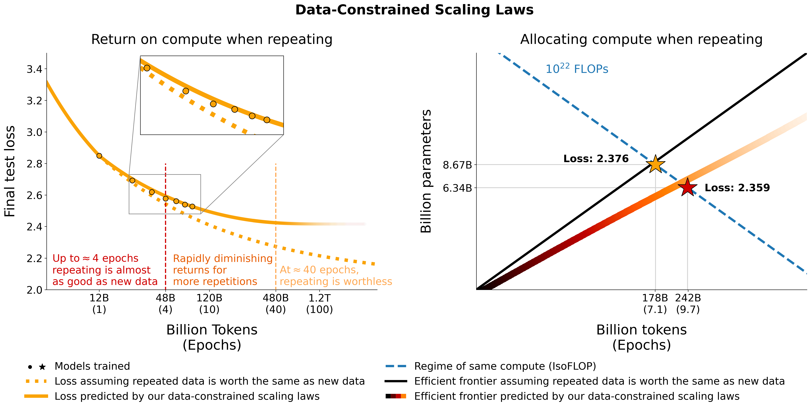

# Scaling Data-Constrained Language Models



This repository provides an overview of all components from the paper [Scaling Data-Constrained Language Models](https://arxiv.org/abs/2305.16264).

We investigate scaling language models in data-constrained regimes. We run a large set of experiments varying the extent of data repetition and compute budget, ranging up to 900 billion training tokens and 9 billion parameter models. Based on our runs we propose and empirically validate a scaling law for compute optimality that accounts for the decreasing value of repeated tokens and excess parameters. We also experiment with approaches mitigating data scarcity, including augmenting the training dataset with code data, perplexity-filtering and deduplication. Models and datasets from our 400 training runs are available via this repository.


<!-- TOC -->

- [Data](#data)
    - [Repeating](#repeating)
    - [Code](#code)
    - [Filtering](#filtering)
        - [Perplexity](#perplexity)
        - [Deduplication](#deduplication)
- [Models](#models)
    - [Download](#download)
    - [Training](#training)
        - [Regular models](#regular-models)
        - [muP](#mup)
- [Parametric Fit](#parametric-fit)
- [Downstream Evaluation](#downstream-evaluation)
    - [Rank Eval / Accuracy](#rank-eval--accuracy)
    - [Generative / Rouge](#generative--rouge)
    - [bAbI / Exact match](#babi--exact-match)
- [Plots & Tables](#plots--tables)
    - [Plots](#plots)
    - [Tables](#tables)
- [License](#license)
- [Citation](#citation)

<!-- /TOC -->

## Data

### Repeating

We experiment with repeating data on [C4](https://huggingface.co/datasets/c4) and the non-deduplicated English split of [OSCAR](https://huggingface.co/datasets/oscar). For each dataset, we download the data and turn it into a single jsonl file, `c4.jsonl` and `oscar_en.jsonl` respectively.

Then we decide on the amount of unique tokens and the respective number of samples we need from the dataset. Note that C4 has `478.625834583` tokens per sample and OSCAR has `1312.0951072` with the GPT2Tokenizer. This was calculated by tokenizing the entire dataset and dividing the number of tokens by the number of samples. We use these numbers to calculate the needed samples.

For example, for 1.9B unique tokens, we need `1.9B / 478.625834583 = 3969697.96178` samples for C4 and `1.9B / 1312.0951072 = 1448065.76107` samples for OSCAR. To tokenize the data, we first need to clone the [Megatron-DeepSpeed](https://github.com/TurkuNLP/Megatron-DeepSpeed) repository and follow its setup guide. We then select these samples and tokenize them as follows:

C4:
```bash
head -n 3969698 c4.jsonl > c4_1b9.jsonl
python Megatron-DeepSpeed/tools/preprocess_data_many_cores.py \
--input c4_1b9.jsonl \
--output-prefix gpt2tok_c4_en_1B9 \
--dataset-impl mmap \
--tokenizer-type PretrainedFromHF \
--tokenizer-name-or-path gpt2 \
--append-eod \
--workers 64
```

OSCAR:
```bash
head -n  1448066 oscar_en.jsonl > oscar_1b9.jsonl
python Megatron-DeepSpeed/tools/preprocess_data_many_cores.py \
--input oscar_1b9.jsonl \
--output-prefix gpt2tok_oscar_en_1B9 \
--dataset-impl mmap \
--tokenizer-type PretrainedFromHF \
--tokenizer-name-or-path gpt2 \
--append-eod \
--workers 64
```

where `gpt2` points to a folder containing all files from https://huggingface.co/gpt2/tree/main. By using `head` we make sure that different subsets will have overlapping samples to reduce randomness.


For evaluation during training and the final evaluation, we use the validation set for C4:

```python
from datasets import load_dataset
load_dataset("c4", "en", split="validation").to_json("c4-en-validation.json")
```
```bash
python Megatron-DeepSpeed/tools/preprocess_data_many_cores.py \
--input c4-en-validation.jsonl \
--output-prefix gpt2tok_c4validation_rerun \
--dataset-impl mmap \
--tokenizer-type PretrainedFromHF \
--tokenizer-name-or-path gpt2 \
--append-eod \
--workers 2
```

For OSCAR which has no official validation set we take a part of the training set by doing `tail -364608 oscar_en.jsonl > oscarvalidation.jsonl` and then tokenize it as follows:

```bash
python Megatron-DeepSpeed/tools/preprocess_data_many_cores.py --input oscarvalidation.jsonl --output-prefix gpt2tok_oscarvalidation --dataset-impl mmap --tokenizer-type PretrainedFromHF --tokenizer-name-or-path gpt2 --append-eod --workers 2
```

We have uploaded several preprocessed subsets for usage with megatron:
- C4: https://huggingface.co/datasets/datablations/c4-subsets
- OSCAR: https://huggingface.co/datasets/datablations/oscar-subsets

Some bin files were too large for git and thus split using e.g. `split --number=l/40 gpt2tok_c4_en_1B9.bin gpt2tok_c4_en_1B9.bin.` and `split --number=l/40 gpt2tok_oscar_en_1B9.bin gpt2tok_oscar_en_1B9.bin.`. To use them for training you need to cat them together again using `cat gpt2tok_c4_en_1B9.bin.* > gpt2tok_c4_en_1B9.bin` and `cat gpt2tok_oscar_en_1B9.bin.* > gpt2tok_oscar_en_1B9.bin`.

### Code

We experiment with mixing code with the natural language data using the Python split from the [the-stack-dedup](https://huggingface.co/datasets/bigcode/the-stack-dedup). We download the data, turn it into a single jsonl file and preprocess it using the same approach as outlined above.

We have uploaded the preprocessed version for usage with megatron here: https://huggingface.co/datasets/datablations/python-megatron. We have split the bin file using `split --number=l/40 gpt2tok_python_content_document.bin gpt2tok_python_content_document.bin.`, so you need to cat them together again using `cat gpt2tok_python_content_document.bin.* > gpt2tok_python_content_document.bin` for training.

### Filtering

We create versions of C4 and OSCAR with perplexity and deduplication-related filtering metadata:
- C4: https://huggingface.co/datasets/datablations/c4-filter
- OSCAR: https://huggingface.co/datasets/datablations/oscar-filter

To recreate these metadata datasets there are instructions at `filtering/README.md`.

We provide the tokenized versions that can be used for training with Megatron at:
- C4: https://huggingface.co/datasets/datablations/c4-filter-megatron
- OSCAR: https://huggingface.co/datasets/datablations/oscar-filter-megatron

`.bin` files were split using something like `split --number=l/10 gpt2tok_oscar_en_perplexity_25_text_document.bin gpt2tok_oscar_en_perplexity_25_text_document.bin.`, so you need to concatenate them back together via `cat gpt2tok_oscar_en_perplexity_25_text_document.bin. > gpt2tok_oscar_en_perplexity_25_text_document.bin`.

To recreate the tokenized versions given the metadata dataset,
- OSCAR:
    - Deduplication: See `filtering/deduplication/filter_oscar_jsonl.py`
    - Perplexity: See below.
- C4:
    - Deduplication: See below.
    - Perplexity: See below.

#### Perplexity

To create the perplexity percentiles, follow the below instructions.

C4:

```python
from datasets import load_dataset
import numpy as np
ds = load_dataset("datablations/c4-filter", streaming=False, num_proc=128)

p_25 = np.percentile(ds["train"]["perplexity"], 25)
p_50 = np.percentile(ds["train"]["perplexity"], 50)
p_75 = np.percentile(ds["train"]["perplexity"], 75)

# 25 - 75th percentile
ds["train"].filter(lambda x: p_25 < x["perplexity"] < p_75, num_proc=128).to_json("c4_perplexty2575.jsonl", num_proc=128, force_ascii=False)
# 25th percentile
ds["train"].filter(lambda x: x["perplexity"] < p_25, num_proc=128).to_json("c4_perplexty25.jsonl", num_proc=128, force_ascii=False)
# 50th percentile
ds["train"].filter(lambda x: x["perplexity"] < p_50, num_proc=128).to_json("c4_perplexty50.jsonl", num_proc=128, force_ascii=False)
```

OSCAR:

```python
from datasets import load_dataset
import numpy as np
ds = load_dataset("datablations/oscar-filter", use_auth_token=True, streaming=False, num_proc=128)

p_25 = np.percentile(ds["train"]["perplexity_score"], 25)
p_50 = np.percentile(ds["train"]["perplexity_score"], 50)

# 25th percentile
ds["train"].filter(lambda x: x["perplexity_score"] < p_25, num_proc=128).remove_columns(['meta', 'perplexity_score', 'text_length', 'url', 'domain', 'dup_ratio', 'pairs', 'repetitions', 'included_in_dedup', 'cluster', 'id']).to_json("oscar_perplexity25.jsonl", num_proc=128, force_ascii=False)
# 50th percentile
ds["train"].filter(lambda x: x["perplexity_score"] < p_50, num_proc=128).remove_columns(['meta', 'perplexity_score', 'text_length', 'url', 'domain', 'dup_ratio', 'pairs', 'repetitions', 'included_in_dedup', 'cluster', 'id']).to_json("oscar_perplexity50.jsonl", num_proc=128, force_ascii=False)
```

You can then tokenize the resulting jsonl files for training with Megatron as described in the [Repeating](#repeating) section.

#### Deduplication


C4:
For C4 you just need to remove all samples where the `repetitions` field is populated, via e.g.

```python
from datasets import load_dataset
import numpy as np
ds = load_dataset("datablations/c4-dedup", use_auth_token=True, streaming=False, num_proc=128)
ds.filter(lambda x: not(x["repetitions"]).to_json('c4_dedup.jsonl', num_proc=128, force_ascii=False)
```

OSCAR:
For OSCAR we provide a script at `filtering/filter_oscar_jsonl.py` to create the deduplicated dataset given the dataset with filtering metadata.


You can then tokenize the resulting jsonl files for training with Megatron as described in the [Repeating](#repeating) section.

## Models

### Download

All models can be downloaded at https://huggingface.co/datablations. 

Models are generally named as follows: `lm1-{parameters}-{tokens}-{unique_tokens}`, specifically individual models in the folders are named as: `{parameters}{tokens}{unique_tokens}{optional specifier}`, for example `1b12b8100m` would be 1.1 billion params, 2.8 billion tokens, 100 million unique tokens. The `xby` (`1b1`, `2b8` etc.) convention introduces some ambiguity whether numbers belong to parameters or tokens, but you can always check the sbatch script in the respective folder to see the exact parameters / tokens / unique tokens.

The easiest way to download a single model is e.g.:
```bash
GIT_LFS_SKIP_SMUDGE=1 git clone https://huggingface.co/datablations/lm1-misc
cd lm1-misc; git lfs pull --include 146m14b400m/global_step21553
```

If this takes too long, you can also use `wget` to directly download individual files from the folder, e.g.:
```bash
wget https://huggingface.co/datablations/lm1-misc/resolve/main/146m14b400m/global_step21553/bf16_zero_pp_rank_0_mp_rank_00_optim_states.pt
```

For models corresponding to the experiments in the paper, consult the following repositories:
- IsoLoss experiments & double descent data from the Appendix:
    - https://huggingface.co/datablations/lm1-misc
    - `lm1-misc/*dedup*` for deduplication comparison on 100M unique tokens in the appendix  
- IsoFLOP experiments:
    - C4:
        - https://huggingface.co/datablations/lm1-8b7-178b-c4-repetitions
        - https://huggingface.co/datablations/lm1-4b2-84b-c4-repetitions
        - https://huggingface.co/datablations/lm1-4b2-84b-c4seeds
        - https://huggingface.co/datablations/lm1-2b8-55b-c4-repetitions
        - https://huggingface.co/datablations/lm1-2b8-55b-c4seeds
    - OSCAR:
        - https://huggingface.co/datablations/lm1-8b7-178b-oscar-repetitions
        - https://huggingface.co/datablations/lm1-4b2-84b-oscar-repetitions
        - https://huggingface.co/datablations/lm1-4b2-84b-oscarseeds
        - https://huggingface.co/datablations/lm1-2b8-55b-oscar-repetitions
        - https://huggingface.co/datablations/lm1-2b8-55b-oscarseeds  
- Code augmentation:
    - C4:
        - https://huggingface.co/datablations/lm1-4b2-84b-c4py
        - https://huggingface.co/datablations/lm1-4b2-84b-c4pyseeds
        - https://huggingface.co/datablations/lm1-2b8-55b-c4py
    - OSCAR:
        - https://huggingface.co/datablations/lm1-2b8-55b-oscarpy
- Perplexity-filtering:
    - C4:
        - https://huggingface.co/datablations/lm1-4b2-84b-c4-perplexity
        - https://huggingface.co/datablations/lm1-2b8-55b-c4-perplexity
        - https://huggingface.co/datablations/lm1-2b8-84b-c4-perplexity
            - These are not referenced anywhere in the paper, but could be used
    - OSCAR:
        - https://huggingface.co/datablations/lm1-4b2-84b-oscar-perplexity
        - https://huggingface.co/datablations/lm1-2b8-55b-oscar-perplexity
- Deduplication:
    - C4:
        - https://huggingface.co/datablations/lm1-4b2-84b-c4-dedup
        - https://huggingface.co/datablations/lm1-2b8-55b-c4-dedup
    - OSCAR:
        - https://huggingface.co/datablations/lm1-4b2-84b-oscar-dedup
        - https://huggingface.co/datablations/lm1-2b8-55b-oscar-dedup
- ROOTS filtering
    - https://huggingface.co/datablations/lm1-4b2-84b-oscarroots
    - https://huggingface.co/datablations/lm1-2b8-55b-oscarroots
- muP (Appendix):
    - https://huggingface.co/datasets/datablations/mup

Other models not analysed in the paper:
- UL2: https://huggingface.co/datablations/lm5-2b8-55b-c4
- All checkpoints of the c4 8b7 model trained for 1 epoch: https://huggingface.co/datablations/lm1-8b7-176b-c4-ckpts
- Adam beta2 ablation: https://huggingface.co/datablations/lm1-8b7-12b-beta
- Warmup ablation: https://huggingface.co/datablations/lm1-83m-20b-nowarmup
- An experiment pre-training only on instruction datasets: https://huggingface.co/datablations/lm1-2b8-55b-realtasky
- Misc runs on The Pile: https://huggingface.co/datablations/lm1-misc-pile
- Misc runs on OSCAR: https://huggingface.co/datablations/lm1-misc-oscar
- IsoFLOP for 1.1B on C4: https://huggingface.co/datablations/lm1-1b1-21b-c4 & https://huggingface.co/datablations/lm1-1b1-21b-c4-repetitions & https://huggingface.co/datablations/lm1-1b1-21b-c4seeds

### Training

#### Regular models

We train models with our fork of Megatron-DeepSpeed that works with AMD GPUs (via ROCm): https://github.com/TurkuNLP/Megatron-DeepSpeed
If you would like to use NVIDIA GPUs (via cuda), you can use the original library: https://github.com/bigscience/Megatron-DeepSpeed

You need to follow the setup instructions of either repository to create your environment (Our setup specific to LUMI is detailed in `training/megdssetup.md`). 

Each model folder contains an sbatch script that was used to train the model. You can use these as a reference to train your own models adapting the necessary environment variables. The sbatch scripts reference some additional files:
- `*txt` files that specify the data paths. You can find them at `utils/datapaths/*`, however, you will likely need to adapt the path to point to your dataset.
- `model_params.sh`, which is at `utils/model_params.sh` and contains architecture presets.
- `launch.sh` that you can find at `training/launch.sh`. It contains commands specific to our setup, which you may want to remove. 

After training you can convert your model to transformers with e.g. `python Megatron-DeepSpeed/tools/convert_checkpoint/deepspeed_to_transformers.py --input_folder global_step52452 --output_folder transformers --target_tp 1 --target_pp 1`.

For repeat models, we also upload their tensorboards after training using e.g. `tensorboard dev upload --logdir tensorboard_8b7178b88boscar --name "tensorboard_8b7178b88boscar"`, which makes them easy to use for visualization in the paper.

#### muP

For the muP ablation in the Appendix we use the script at `training_scripts/mup.py`. It contains setup instructions.

## Parametric Fit

You can use our formula to compute the expected loss given parameters, data and unique tokens as follows:

```python
import numpy as np
func = r"$L(N,D,R_N,R_D)=E + \frac{A}{(U_N + U_N * R_N^* * (1 - e^{(-1*R_N/(R_N^*))}))^\alpha} + \frac{B}{(U_D + U_D * R_D^* * (1 - e^{(-1*R_D/(R_D^*))}))^\beta}$"
a, b, e, alpha, beta, rd_star, rn_star = [6.255414, 7.3049974, 0.6254804, 0.3526596, 0.3526596, 15.387756, 5.309743]

A = np.exp(a)
B = np.exp(b)
E = np.exp(e)
G = ((alpha*A)/(beta*B))**(1/(alpha+beta))

def D_to_N(D):
    return (D * G)**(beta/alpha) * G

def scaling_law(N, D, U):
    """
    N: number of parameters
    D: number of total training tokens
    U: number of unique training tokens
    """
    assert U <= D, "Cannot have more unique tokens than total tokens"

    A = np.exp(a)
    B = np.exp(b)
    E = np.exp(e)

    RD = np.maximum((D / U) - 1, 0)    
    UN = np.minimum(N, D_to_N(U))
    RN = np.maximum((N / UN ) - 1, 0)

    L = E + A/(UN + UN*rn_star*(1-np.exp(-1*RN/rn_star)))**alpha + B / (U + U * rd_star * (1 - np.exp(-1*RD/(rd_star))))**beta
    return L

# Models in Figure 1 (right):
print(scaling_law(6.34e9, 242e9, 25e9)) # 2.2256440889984477 # <- This one is better
print(scaling_law(8.67e9, 178e9, 25e9)) # 2.2269634075087867
```

Note that the actual loss value is unlikely to be useful, but rather the trend of the loss as e.g. the number of parameters increases or to compare two models like in the example above. To compute the optimal allocation, you can use a simple grid search:

```python
def optimal_allocation(N_BASE, D_BASE, U_BASE):
    min_l = float("inf")
    for i in np.linspace(1.0001, 3, 500):
        D =  D_BASE*i
        U = min(U_BASE, D)
        N = N_BASE/i
        new_l = scaling_law(N, D, U)
        if new_l < min_l:
            min_l, min_t, min_s = new_l, D, N
        D =  D_BASE/i
        U = min(U_BASE, D)
        N = N_BASE*i
        new_l = scaling_law(N, D, U)
        if new_l < min_l:
            min_l, min_t, min_s = new_l, D, N
     return min_l, min_t, min_s

_, min_t, min_s = optimal_allocation(8.67e9, 178e9, 25e9)
print(f"Optimal configuration: {min_t} tokens, {min_t/25e9} epochs, {min_s} parameters")
# -> 227B tokens, 9.1 epochs, 6.8B parameters
# We went more extreme in Figure 1 to really put our prediction of "many epochs, fewer params" to the test
```

If you derive a closed-form expression for the optimal allocation instead of the above grid search, please let us know :) We fit data-constrained scaling laws & the C4 scaling coefficients using the code at `utils/parametric_fit.ipynb` equivalent to [this colab](https://colab.research.google.com/drive/1tYIfsmOMoz4dZ_JiVp998vZiMhRqSQrf?usp=sharing).

## Downstream Evaluation

### Rank Eval / Accuracy

1. Follow the instructions in the `Training` > `Regular models` section to setup a training environment.
2. Install the evaluation harness: `pip install git+https://github.com/EleutherAI/lm-evaluation-harness.git`. We used version 0.2.0, but newer versions should work as well.
3. Run `sbatch utils/eval_rank.sh` modifying the necessary variables in the script first
4. After running, we convert each file to csv using `python Megatron-DeepSpeed/tasks/eval_harness/report-to-csv.py outfile.json`

### Generative / Rouge

1. Clone the `addtasks` branch of the evaluation harness: `git clone -b addtasks https://github.com/Muennighoff/lm-evaluation-harness.git`
2. Setup an environment with `cd lm-evaluation-harness; pip install -e ".[dev]"; pip uninstall -y promptsource; pip install https://github.com/Muennighoff/promptsource.git@tr13` i.e. all requirements except promptsource, which is installed from a fork with the correct prompts
3. Make sure your checkpoint path is a transformers checkpoint path
4. Run `sbatch utils/eval_generative.sh` modifying the necessary variables in the script first
5. After running, we merge the generation files using `python utils/merge_generative.py` and then convert them to csv with `python utils/csv_generative.py merged.json`

### bAbI / Exact match

1. Clone the `babi` branch of the evaluation harness: `git clone -b babi https://github.com/Muennighoff/lm-evaluation-harness.git` (Note that this branch is not compatible with the `addtasks` branch for generative tasks as it stems from `EleutherAI/lm-evaluation-harness`, while `addtasks` is based on `bigscience/lm-evaluation-harness`)
2. Setup an environment with `cd lm-evaluation-harness; pip install -e ".[dev]"`
3. Make sure your checkpoint path is a transformers checkpoint with tokenizer files (If you trained a gpt2 model like all models in this work, it's just the files from here: https://huggingface.co/gpt2)
4. Run `sbatch utils/eval_babi.sh`  modifying the necessary variables in the script first

## Plots & Tables

### Plots

- Figure 1: `plotstables/return_alloc.ipynb`, `plotstables/return_alloc.pdf` & [colab](https://colab.research.google.com/drive/1wW3SjEoG6zPSsI7JI8TyY5uwYhVHvcLD?usp=sharing)
- Figure 2: `plotstables/dataset_setup.ipynb`, `plotstables/dataset_setup.pdf` & [colab](https://colab.research.google.com/drive/1AqqoNduhgzOZs73geDlLBmmR8_q4frDf?usp=sharing)
- Figure 3: `plotstables/contours.ipynb`, `plotstables/contours.pdf` & [colab](https://colab.research.google.com/drive/17eH3k6-Nh4NNTsjAMecossCghbL8Xe47?usp=sharing)
- Figure 4: `plotstables/isoflops_training.ipynb`, `plotstables/isoflops_training.pdf` & [colab](https://colab.research.google.com/drive/1i00FUdVp0Oj-Qw40ITLSGXwzuxpqBjmw?usp=sharing)
- Figure 5: `plotstables/return.ipynb`, `plotstables/return.pdf` & [colab](https://colab.research.google.com/drive/11L5AC2noZqlixQWjvSjCvGB_WnOWyuv7?usp=sharing)
- Figure 6 (Left): `plotstables/strategies.drawio` & `plotstables/strategies.pdf`
- Figure 6 (Right): `plotstables/beyond.ipynb`, `plotstables/beyond.pdf` & [colab](https://colab.research.google.com/drive/1SqB-4WxFm0WXL7rGqfwXjakjIb1yy6EA?usp=sharing)
- Figure 7: `plotstables/cartoon.pptx` & `plotstables/cartoon.pdf`
- Figure 8: `plotstables/isoloss_400m1b5.pdf` & same colab as Figure 3
- Figure 9 - 11: `plotstables/mup_dd_dd.ipynb`, `plotstables/mup.pdf`, `plotstables/dd.pdf`, `plotstables/dedup.pdf` & [colab](https://colab.research.google.com/drive/1ghSdJMrGDaK_KM5vUgHYXkptS3sqKs8k?usp=sharing)
- Figure 12: `plotstables/isoloss_alphabeta_100m.pdf` & same colab as Figure 3
- Figure 13: `plotstables/galactica.ipynb`, `plotstables/galactica.pdf` & [colab](https://colab.research.google.com/drive/146lFaI6fhIdXaOAgtaqV4X3-rNGrH92C?usp=sharing)
- Figure 14 - 17: `training_c4.pdf`, `validation_c4oscar.pdf`, `training_oscar.pdf`, `validation_epochs_c4oscar.pdf` & same colab as Figure 4
- Figure 18: `plotstables/perplexity_histogram.ipynb` &  `plotstables/perplexity_histogram.pdf`
- Figure 19 - 37: Manual

### Tables

- Table 1: Manual
- Table 2 - 7: `plotstables/repetition.ipynb` & [colab](https://colab.research.google.com/drive/19KW4ZiZ9iKzUY89A3IvRFzceGRpkyUK1?usp=sharing)
- Table 8 - 9: `plotstables/python.ipynb` & [colab](https://colab.research.google.com/drive/1gFd83xDZ9JTTYkpaM2xCEgFcSKEpuTPH?usp=sharing)
- Table 10: Manual
- Table 11 - 12: `plotstables/filtering.ipynb` & [colab](https://colab.research.google.com/drive/1OKkrGBgRI8Uu_dq6RF8q_OIFGP-Saeah?usp=sharing)
- Table 13: Manual

## License

All models & code are licensed under Apache 2.0. Filtered datasets are released with the same license as the datasets they stem from.

## Citation

```bibtex
@article{muennighoff2023scaling,
      title={Scaling Data-Constrained Language Models}, 
      author={Niklas Muennighoff and Alexander M. Rush and Boaz Barak and Teven Le Scao and Aleksandra Piktus and Nouamane Tazi and Sampo Pyysalo and Thomas Wolf and Colin Raffel},
      year={2023},
      eprint={2305.16264},
      archivePrefix={arXiv},
      primaryClass={cs.CL}
}
```
